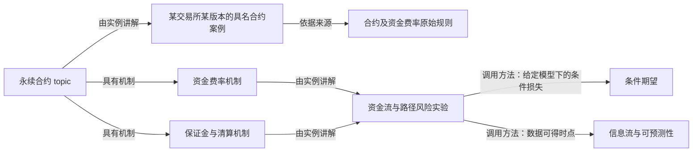
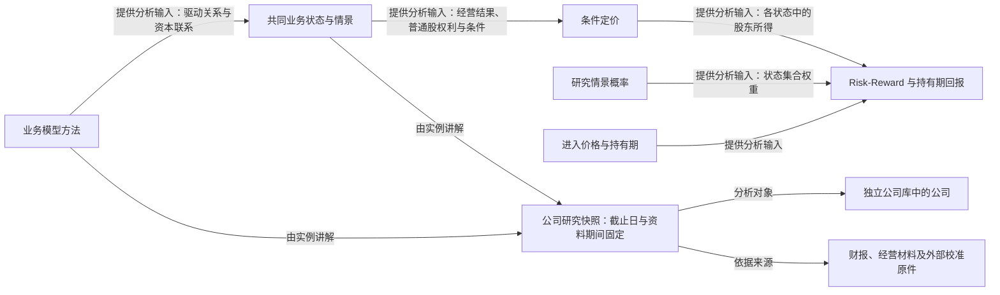

# 投资学笔记：知识图谱与内容关系

版本：2026-09-21。本文定义与 [详细大纲](investment-notebook-outline.md)、[写作规范](notebook-authoring.md) 同源的内容关系与展示职责；当前是规划，网页功能尚未实现。Agent 阅读与导出沿 [Agent 模板](notebook-agent-template.md)。

## 1. 图谱与目录、路径的关系

知识图谱是现有内容关系的一种阅读视图。**Topic 目录提供学科位置，领域主线提供推荐阅读顺序，图谱显示一项内容和哪些概念、方法、实例、研究及原始来源相连。** 三者引用相同永久 ID；不复制正文，不另写一套图谱内容。

现有 `notebook/entries/*.json` 仍维护正文、定义、实例、来源与关系；`notebook/catalogue.json` 维护 topic 层级和领域主线。构建时据此生成图所需索引。图谱可以有生成文件或搜索索引，但它们不能成为人工维护的第二份事实源。

路径的相邻两篇不自动生成“必要先修”边；正文出现的链接不自动生成先修、因果或证明关系。没有注明语义的一般引用最多作为次要“相关引用”，默认不挤入局部图。

## 2. 节点：沿用实际存在的内容身份

| 节点 | 实际内容 | 图中作用 |
|---|---|---|
| 领域 / topic | 现行目录节点 | 定位、聚合、折叠 |
| 词条 / 具名节 | 概念、契约、方法、命题、策略等已有学习单元 | 学习与引用的主要节点；只为值得独立引用的节建立节点 |
| 公司 / 证券 | 独立公司库的企业身份及明确区分的证券身份 | 汇集业务与研究；与具体股票类别保持区分 |
| 有日期的研究或案例 | 公司研究快照、行业案例、具体合约或报表实例 | 连接实际对象、资料期间、研究截止日和教学用途 |
| 实验 | 如 EXP-STATE-01、EXP-HEDGE-01 的同源输入及输出 | 多词条共用计算对象，防止形成两本账 |
| 来源 | 原始文献、财报、合约文件、数据版本 | 查证依据及 Agent 必读材料入口 |

不会为每个普通名词、每段正文或每次出现的引用生成节点。公司节点也不是金融概念的子节点；它出现在独立公司库，通过有日期的实例建立联系。

## 3. 有方向、有语义的边

箭头按关系名称解读。`A —需要先修→ B` 表示学习 A 前需掌握 B；它不是“先读 A 再读 B”。图上显示中文关系标签和悬停说明，不能只用颜色区分。

| 关系类型 | 方向与意思 | 必须记录的说明 |
|---|---|---|
| `part_of` 属于 | 具体 topic / 词条 → 主 topic | 唯一主要归属；跨领域使用靠其他边 |
| `requires` 需要先修 | 当前词条 → 真正必要的能力或词条 | 必须已会什么；不能仅因引用而创建 |
| `uses_method` 调用方法 | 应用 / 实验 → 被调用的概念或方法 | 哪一步调用、所需版本/范围；通常允许就地补充 |
| `derived_from` 推导依据 | 命题 / 结果 → 已用前提、引理或定义 | 适用条件及证明锚点；不能把经验关联标成演绎推导 |
| `has_mechanism` 具有机制 | 工具 / 安排 → 组成机制 | 哪一规则或经济联系；不是一条学习先修 |
| `illustrated_by` 由实例讲解 | topic / 词条 → 具体案例或实验 | 本例解释什么；保留案例版本与日期 |
| `supported_by` 依据来源 | 具体陈述 / 分析节 / 研究快照 → 来源或原件定位 | 支持的范围、页/节/原表行、版本；目录只支持目录层级主张 |
| `analyzes` 分析对象 | 有日期的研究快照 → 公司 / 行业 / 证券 | 研究范围与对象身份；公司研究和某股票类别价格分开 |
| `informs` 提供分析输入 | 上一步分析结果 → 下一步分析对象 | 提供什么输入、有哪些条件；不暗示必然因果或唯一答案 |
| `updates` 后续研究 | 新快照 → 被更新的旧快照 | 更新的是哪项研究范围；旧版本仍可独立访问 |

需要比较时，可另设 `compares_with`，明确比较维度；它是对称关系，不进入先修排序。来源、案例、方法边均不能因为图形接近就被解释为“所有内容都必须读过”。

每条人工维护的关系最少有：`from`、`relation`、`to`、`reason`，按需要有 `at_section`、`conditions`、`scope`。先修边还须有 `required_competence`；来源边可复用已有引用定位；这些字段保存于拥有该关系的现有条目中，构建时汇总。

## 4. 局部图优先，完整图作为探索入口

词条页默认显示当前内容的一跳局部图，优先展示：**所在 topic、少量必要先修、直接调用的方法、当前采用的实例及来源**。来源与证明可以分组折叠，读者按需展开第二跳；不默认展示全站数百节点。

读者可切换“学习关系”“推导与方法”“实例与证据”三个视角，但底层仍是同一关系集。沿当前领域主线进入时，推荐前后篇作轻量叠加，不改写硬先修图。

点击节点就地打开内容预览：

- 概念：精确定义、必要条件和当前段落所需解释。
- 命题：条件、结论、证明入口及本次调用的具体步骤。
- 案例：对象、资料期间、研究截止、关键原表/图和它说明的关系。
- 来源：书目信息、实际支持范围、原文定位，以及“全文 / 指定节 / 摘要 / 目录”的资料状态。
- 公司：业务入口与研究时间线；返回当前引用位置不丢进度。

局部图与正文引用共用预览内容、深链和键盘操作。移动端可切换成有标签的关系列表；图不成为理解正文的唯一入口。Agent 导出可以提供相同关系的文字邻接表，并带必读原文清单和实际读取协议。

## 5. 示例一：永续合约、资金费率与风险计算

下面 ID 和图是关系示例，不表示对应词条已经成稿。具体永续合约必须按其交易所、币种、结算和规则版本引用原始材料；这里不虚构统一规则。

对应骨架为 M24–26、P32，数学方法按具体实验调用 QT07/QT11。关键边界：理解实际资金费率怎样收付，并不要求先修一般条件期望存在性证明；只有当实验要计算未来资金流或损失的条件平均时，才调用相应方法。合约规则决定支付安排，研究者的随机模型决定如何描述未知路径，二者分开。资金费率、保证金、清算价格不能在图上混成同一个“成本”节点。

## 6. 示例二：业务模型、状态、条件定价与 Risk-Reward

对应骨架为 BF-01、BF-18 与 EI 机制 → P04 → P28–30 → P31，P05 提供状态集合权重。这里的箭头是研究输入关系，不宣称业务模型唯一决定价格。条件定价使用什么方法及可比口径须在相应词条说明；情景概率是独立研究判断，不从定价概率 Q 偷换而来。图不引入 DCF/WACC，也不把一个公司的当期研究当成永久普遍事实。

## 7. 时间与版本：避免引用被静默改写

公司是稳定实体；研究与案例是固定时点的独立节点。至少分别记录 `period`（材料期间）、`cutoff`（研究所用信息截止日）、`revised`（编辑日期）。使用市场价格时另记报价时点。来源保存版本或所用期次。

教学案例一旦采用某研究快照，其 `illustrated_by` / `supported_by` 边指向该快照永久 ID，不能只指向公司“最新研究”。公司入口可以显示当前版本；旧课程和旧案例仍指向原有版本。新研究通过 `updates` 连接旧研究，而不是复用旧快照 ID 覆盖数据。

截至某日查看图时，依据节点和来源的可得时间过滤；不能只按正文编辑日期过滤，也不能把后来修订数据混入当时判断。历史视图以实际留存版本为准，缺少历史版本时明确该缺口，不生成假历史。

## 8. 构建时的有限检查

1. **身份与端点：** 已有稳定 ID 唯一，所有边端点可解析；未写成的计划节点不进入已发布知识图。
2. **类型与方向：** 关系类型在固定集合中；公司实体不被挂成概念目录子项；来源边有实际定位；一般引用不自动升级先修。
3. **硬先修环：** 只对 `requires` 子图检测有向环，报告具体环及每条边理由。`uses_method`、比较、互相引用可以成环，不因此拒绝构建。修复方式是澄清必要能力、拆共享基础或改为就地方法调用，不自动删边。
4. **理论循环依赖：** 对明确标成证明依赖的 `derived_from` 检查循环，并人工核对是重复表述、同时定义还是实际循环证明；不把普通经济反馈环当逻辑错误。
5. **时间快照：** 已发布案例应绑定快照 ID 和材料期间。对相同快照 ID 的 `period`、`cutoff`、原始输入版本发生替换进行检查，报告可能的覆盖；单纯勘误允许保留 ID，但有修订记录。此规则不是禁止纠错。
6. **新版本不得重绑旧引用：** 生成公司“最新”入口时，不批量改写旧案例的目标。检查已发布案例指向 `latest` 之类动态别名的情况，并要求改成实际版本。
7. **范围与支持：** 目录/摘要来源不能满足需要原文的 Agent 必读单元；图显示的是来源支持范围，不把“有一条来源边”当结论已获证明。

检查复用现有内容生成流程；无需额外图数据库、后台服务或独立编辑界面。图谱先在少数词条的真实关系上工作，之后随正文自然增长，不为图形密度制造连接。
